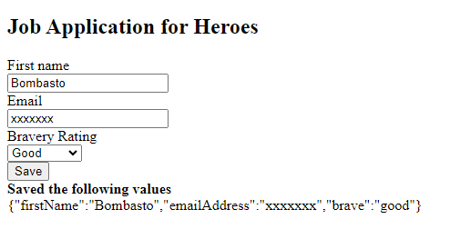
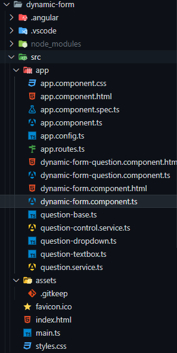

# Atividade SPA
Nessa atividade, a proposta é criar um formulário (seguindo o artigo da página do Angular).

É uma atividade simples, mas é muito importante para o aprendizado, de Angular, que é uma tecnologia que usa o conceito de SPA (Single Page Application).

Esse conceito gira em torno de uma aplicação Front-End que não precisa recarregar a página para mudar de rota, ou seja, a aplicação é carregada uma única vez e as mudanças de rota são feitas sem recarregar a página. O único "carregamento" que ocorre são os componentes que são carregados na página, mas a página em si não é recarregada, e o navegador não precisa fazer uma nova requisição ao servidor para carregar outra página.

## Formulário (código em execução)

## Estrutura de arquivos
